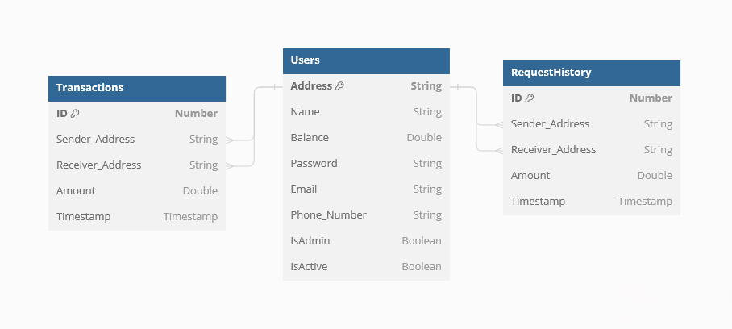

# Simple Digital Wallet


## Table of Contents

- [Introduction](#introduction)
- [Features](#features)
- [Data Structures Used](#data-structures-used)
- [Project Schema](#project-schema)
- [File Handling](#file-handling)
- [Usage](#usage)
- [Installation](#installation)
- [Contributing](#contributing)

## Introduction

Welcome to the Simple Digital Wallet! This project has evolved through two versions. The original version was developed as a team project during university using C++, focusing on efficient data structures and handling financial transactions securely. The second version is a complete rewrite as a Web API using .NET technology, enhancing scalability and integrating modern web features.

## Features

- **User Authentication and Management**: Includes functionalities for both admins and regular users.
- **Secure Password Handling**: Utilizes encryption and hashing for secure password management.
- **Transaction Management**: Supports sending, requesting, and viewing transaction history.
- **Notification System**: Handles notifications for money requests.
- **Deposit and Withdrawal Functionalities**: Allows users to deposit and withdraw funds.
- **Profile Management**: Enables users to edit their profile details.
- **Error Handling**: Robust handling of various error scenarios.

## Data Structures Used

1. **unordered_map<string, User> mapOfUsers**: Stores user information, with the user's address as the key and an instance of the User class as the value.
2. **vector<Transaction> transactions**: Maintains transaction history, including sender and receiver addresses, transaction amounts, and types.
3. **vector<Transaction> RequestHistory**: Specifically tracks transaction history related to money requests.
4. **queue<char> passwordQueue**: Manages characters for password input with masking.

## Project Schema



The schema represents the data structure used in both versions:

- **Users Table**: Stores user information such as address, name, and balance.
- **Transactions Table**: Logs all transactions with sender and receiver addresses, amounts, and types.
- **RequestHistory Table**: Tracks money requests between users, including sender and receiver addresses, amounts, and timestamps.

## File Handling

In the C++ version, the `Files` class manages reading from and writing to files, including user information and transaction history. This functionality has been adapted for the Web API version using database interactions.

## Usage

To use the Simple Digital Wallet, follow these steps:

1. Clone the repository.
2. Compile and run the project using your preferred IDE or command line.
3. For the Web API version, interact with the endpoints for user management and transactions as described in the documentation.

## Installation

1. Clone the repository:
    ```bash
    git clone https://github.com/Abraam318/simple-digital-wallet.git
    ```
2. Navigate to the project directory:
    ```bash
    cd simple-digital-wallet
    ```
3. Compile and run the project for the C++ version, or follow the .NET Web API setup instructions for the API version.

## Contributing

Contributions are welcome! Please fork the repository and submit a pull request.
